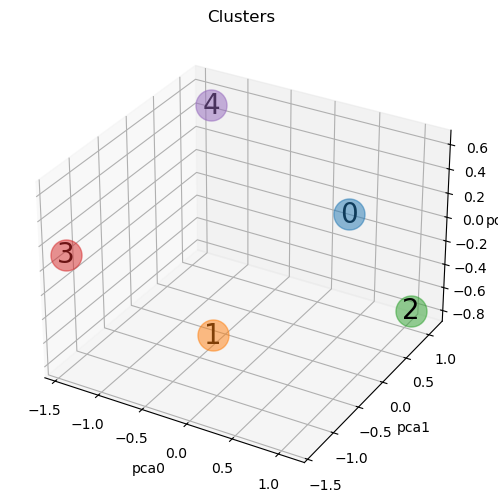

[](https://www.linkedin.com/in/richardrafi/)
[](https://www.python.org/)

# Segmentação de clientes de um supermercado

Um supermercado coletou dados básicos sobre seus clientes através de cartões de fidelidade (ou associação), como o ID do Cliente, idade, gênero, renda anual e pontuação de gastos. A pontuação de gastos é uma métrica definida com base no comportamento do cliente e nos padrões de compra. 

Para compreender melhor o comportamento de seus clientes, o dono do Supermercado X decidiu contratar um Cientista de Dados para obter insights afim de identificar os padrões de consumo de seus consumidores, estes dados serão direcionados à equipe de marketing para otimizar estratégias e campanhas, afim de aumentar a retenção de clientes e personalizar ofertas conforme o seu comportamento.



[Link original para o dataset](https://www.kaggle.com/vjchoudhary7/customer-segmentation-tutorial-in-python)

Este projeto aplicou clusterização para segmentar clientes de um supermercado. Para definir o número ideal de clusters, foram empregados o Método do Cotovelo (Elbow Method) e o Método da Silhueta (Silhouette Method). Além disso, foram aplicadas técnicas de pré-processamento como a padronização com StandardScaler e a construção de pipelines para melhorar o desempenho do modelo.

As principais bibliotecas utilizadas do Python foram:

- Pandas –> Manipulação de dados e dataframes
- Matplotlib e Seaborn –> Visualização de métricas e análises gráficas
- ydata_profiling –> Análise exploratória automatizada
- Scikit-Learn –> Modelagem, clusterização e avaliação de métricas

Este projeto foi desenvolvido no curso de Ciência de Dados da [Hashtag Treinamentos](https://www.hashtagtreinamentos.com/) e demonstra a aplicação prática de Machine Learning e técnicas de pré-processamento e clustering para segmentação de clientes.

<a href="https://www.linkedin.com/in/richardrafi/" target="_blank"></a> 

## Objetivos

O objetivo deste projeto é realizar a segmentação de clientes de um supermercado com base em seus dados de compra, utilizando técnicas de Análise de Dados e Machine Learning. Essa segmentação permitirá identificar padrões de consumo e otimizar estratégias de marketing, maximizando o retorno sobre investimento (ROI) além de possibilitar a personalização de ofertas e aumentar a retenção de clientes.

Objetivos detalhados:

- Passo 1: O primeiro passo foi explorar e tratar os dados utilizando a biblioteca Pandas e Seaborn. Para agilizar o processo de análise e facilitar a obtenção de insights, utilizei a biblioteca ydata_profiling, que gerou um relatório em HTML com estatísticas descritivas, valores ausentes, distribuição de variáveis e correlações. Isso permitiu entender melhor as características dos clientes e identificar possíveis tratamentos que poderiam ser feitos na base de dados, caso necessário.
  
- Passo 2: Para agrupar os clientes com perfis semelhantes, foi implementado um modelo de clustering utilizando o Scikit-Learn. O pré-processamento incluiu a aplicação do Método do Cotovelo e da Silhueta com o K-Means para determinar o número ideal de clusters a ser utilizado no pipeline, posteriormente, foi gerado o gráfico de dispersão, gráfico de caixa e um gráfico tridimensional para identificar o posicionamento dos centróides e dos pontos dos clusters, além de analisar tendências baseadas no gênero, a faixa de idade, renda e pontuação de gasto dos clientes.

- Passo 3: Similar ao passo 2, a diferença é que esta etapa, foi aplicada a técnica de Redução de Dimensionalidade com PCA dentro do pipeline de Machine Learning. A comparação dos resultados com e sem PCA demonstrou que, embora a estrutura dos clusters tenha se mantido semelhante, não houve diferença significativa nos resultados entre o modelo com ou sem redução de dimensionalidade, e sim, a diferença da segmentação dos clientes em cada cluster.

## Estrutura do repositório

O repositório está estruturado da seguinte forma:

```
├── dados
├── imagens
├── modelos
├── notebooks
├── reports
```

- Na pasta `dados` estão os dados utilizados no projeto. O arquivo `Mall_Customers.csv` é o dataset utilizado originalmente. Os demais arquivos são os datasets gerados durante o projeto.
- Na pasta `imagens` estão as imagens utilizadas neste README.
- Na pasta `modelos` estão os modelos gerados durante o projeto. 
- Na pasta `notebooks` estão os notebooks com o desenvolvimento do projeto. Em detalhes, temos:
  - [`projeto_supermercado_01_eda.ipynb`](notebooks/projeto_supermercado_01_eda.ipynb): notebook com a análise exploratória dos dados usando [ydata-profiling](https://github.com/ydataai/ydata-profiling) e Seaborn.
  - [`projeto_supermercado_04_pipeline.ipynb`](notebooks/projeto_supermercado_04_pipeline.ipynb): notebook com a clusterização dos dados usando K-Means com pré-processamento utilizando pipelines do Scikit-Learn.
  - [`projeto_supermercado_05_pipeline_pca.ipynb`](notebooks/projeto_supermercado_05_pipeline_pca.ipynb): notebook com a clusterização dos dados usando K-Means após redução de dimensionalidade com PCA utilizando pipelines do Scikit-Learn.
  - [`funcoes_auxiliares.py`](notebooks/funcoes_auxiliares.py): arquivo com funções auxiliares utilizadas nos notebooks.
- Na pasta `reports` estão os relatórios gerados durante o projeto utilizando a biblioteca [ydata-profiling](https://github.com/ydataai/ydata-profiling).

## Detalhes do dataset utilizado e resumo dos resultados

O dataset utilizado é o contido no arquivo [`Mall_Customers.csv`](dados/Mall_Customers.csv), que contém os seguintes dados:

- `CustomerID`: ID do cliente
- `Gender`: gênero do cliente (Masculino ou Feminino)
- `Age`: idade do cliente 
- `Annual Income (k$)`: renda anual do cliente
- `Spending Score (1-100)`: pontuação de gastos do cliente

Com o pipeline realizando pré-processamento, PCA e K-Means, a base foi segmentada em 5 clusters, como mostrado nas figuras abaixo:


- Cluster 0 - pontuação de gastos moderada, renda moderada, idade alta, o gênero feminino tem maior pontuação de gastos, enquanto o masculino tem a maior idade e renda anual.
- Cluster 1 - pontuação de gastos moderada, renda moderada, idade jovem, o gênero feminino tem a maior renda anual e a maior idade, enquanto o masculino tem maior pontuação de gastos.
- Cluster 2 - pontuação de gastos baixa, renda alta, idade moderada, o gênero feminino tem maior pontuação de gastos, nota-se que os boxplots de idade entre ambos dos gêneros estão praticamente iguais, sendo que o masculino leva uma ligeira vantagem.
- Cluster 3 - pontuação de gastos alta, renda baixa, idade jovem, o gênero feminino tem maior pontuação de gastos, a maior idade e renda anual.
- Cluster 4 - pontuação de gastos alta, renda alta, idade jovem, o gênero feminino tem a maior renda anual, enquanto o masculino tem a maior idade e pontuação de gastos.

- Nota-se que em quatro dos cinco clusters, a predominância do gênero é feminina, somente no 3, que o masculino é maior que o feminino.

Siglas:
- MIG - Maior Idade por Gênero
- MRG - Maior Renda por Gênero
- MPG - Maior Pontuação por Gênero

Transformando os pontos acima em uma tabela

| Pontuação de Gastos | Renda | Idade | Cluster |  Gênero |   MIG   |   MRG   |   MPG   |
|---------------------|-------|-------|---------|---------|---------|---------|---------|
| Moderada            | Moderada | Alta | 0     | Feminino| Masculino| Masculino| Feminino |
| Moderada            | Moderada | Jovem | 1       | Feminino| Feminino| Feminino | Masculino|
| Baixa               | Alta  | Moderada | 2       | Masculino| Masculino| Feminino | Feminino |
| Alta                | Baixa | Jovem | 3       | Feminino| Feminino | Feminino | Feminino |
| Alta                | Alta  | Jovem | 4       | Feminino| Masculino| Feminino | Masculino|


## Como reproduzir o projeto

O projeto foi desenvolvido utilizando o Python 3.12.5. Para reproduzir o projeto, crie um ambiente virtual com o Conda, ou ferramenta similar, com o Python 3.12.5 e instale as bibliotecas abaixo:

|  Biblioteca   |  Versão | 
| ------------- | ------- |
|Matplotlib     |  3.9.2  |
|NumPy          |  2.1.3  |
|Pandas         |  2.2.2  |
|Scikit-Learn   |  1.5.1  |
|Seaborn        |  0.13.2 |
 
Essas são as principais bibliotecas utilizadas neste projeto. O relatório da Análise Exploratória foi gerado com a biblioteca [ydata-profiling](https://github.com/ydataai/ydata-profiling), instale-a se quiser reproduzir o relatório. Para ter um gráfico em 3 dimensões interativo, instale a biblioteca [ipympl](https://matplotlib.org/ipympl/) e use o comando `$ Matplotlib ipympl`.